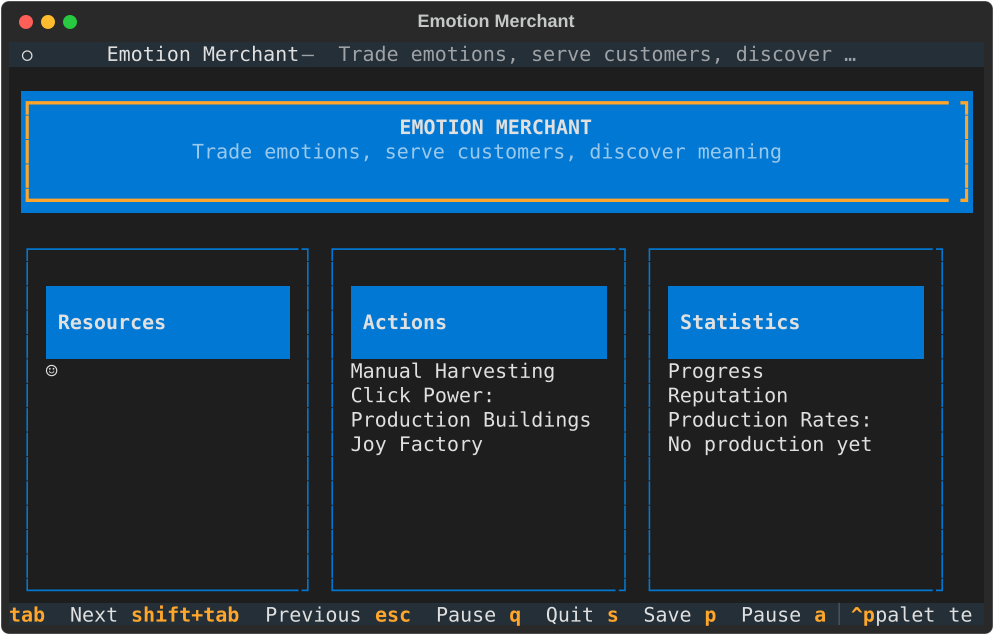
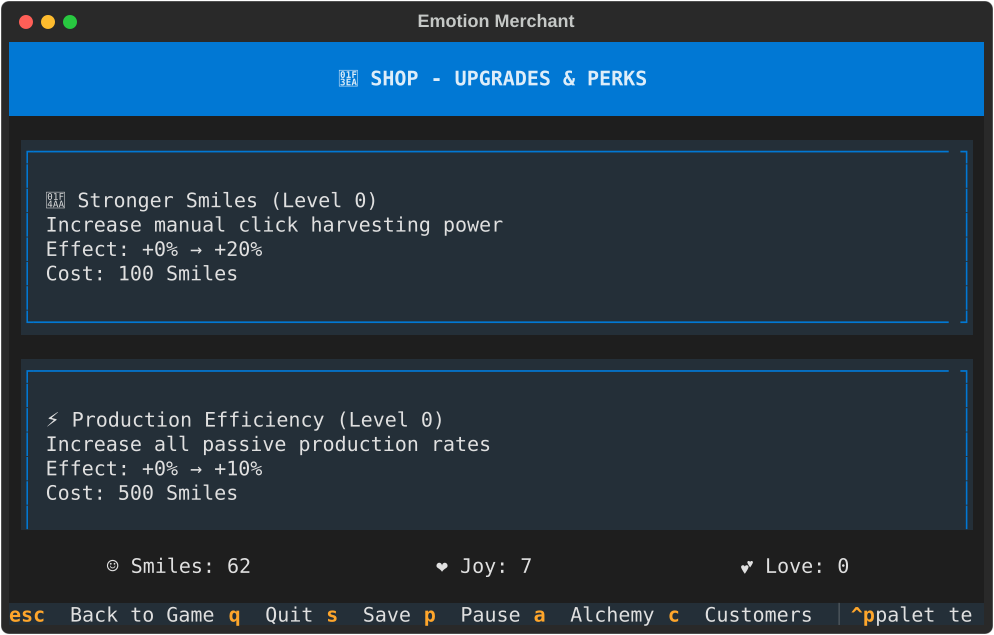
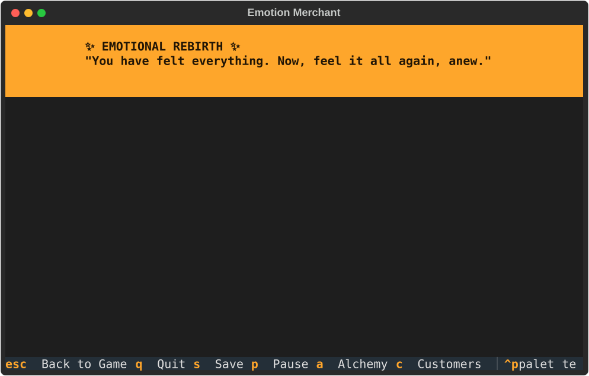

# Emotion Merchant (Name TBD)

A terminal-based idle game where you trade in the economy of feelings. Extract emotions from experiences, refine them into pure essence, and serve customers seeking specific emotional states.

Built with [Textual](https://textual.textualize.io/) - a modern Python framework for creating sophisticated terminal user interfaces with reactive programming.

## A notice about vibe coding

This is mostly a vibe coded experimental project in my spare time, investigating how to solve ideas for side projects in new technology. The primary focus here is to mess around with python, the terminal, and game design in general. A _vast_ majority of the code written at this time is not written by me.

**Project Restart (January 2026)**: This project was completely restarted from scratch using the latest Textual framework and modern idle game design principles. All previous implementation work was removed; only the game design documentation was retained.

## Quick Start

### Prerequisites

Install [uv](https://docs.astral.sh/uv/) - a fast Python package manager:

```bash
curl -LsSf https://astral.sh/uv/install.sh | sh
```

### Terminal Version

```bash
# Clone and setup (installs all dependencies automatically)
git clone <repository>
cd namless-idle-tui
uv sync --all-extras

# Run in terminal
uv run python src/idle_game/app.py
```

### Web Version

The app can also run in your browser using Textual's web server:

```bash
# Same setup as above
uv sync --all-extras

# Run web server
uv run textual serve --port 8080 src.idle_game.app:IdleGameApp

# Open http://localhost:8080 in your browser
```

**Why uv?** 10-100x faster than pip, automatic virtual environment management, reproducible builds via lockfile.

## Game Overview

In Emotion Merchant, you:

- **Harvest** smiles through clicks and passive collection
- **Refine** basic emotions into powerful essences
- **Serve** customers with specific emotional needs
- **Manage** purity, storage, and ethical choices
- **Progress** through 10 tiers of emotional complexity

## Screenshots

### Fresh Start

*The game begins with just Smiles - click to harvest your first emotions!*

### Early Game - After Clicking

*After harvesting enough Smiles, tutorial customers will appear to unlock new emotions.*

### Mid Game - Joy Unlocked

*With Joy unlocked, you can purchase Joy producers that passively generate Smiles.*

### Upgrade Shop

*Visit the shop to purchase upgrades that boost click power, production, and storage.*

### Prestige System

*When ready, perform Emotional Rebirth to gain permanent bonuses through Emotional Depth.*

### Advanced Gameplay

*With multiple emotions unlocked, manage your production chains and resource flows.*

## Core Resources

| Tier | Resource | Cost | Production | Symbol |
|------|----------|------|------------|--------|
| 0 | Smiles | Click: 5 | 1/sec | ☺ |
| 1 | Joy | 10 Smiles | 0.5 Smiles/sec | ❤ |
| 2 | Love | 100 Joy | 2 Joy/sec | 💕 |
| 3 | Nostalgia | 500 Love | 5 Love/sec | ❖ |
| 4 | Serenity | 2.5K Nostalgia | 10 Nostalgia/sec | ◉ |
| 5 | Euphoria | 12.5K Serenity | 50 Serenity/sec | ✧ |
| 6 | Compassion | 62.5K Euphoria | 100 Euphoria/sec | ❀ |
| 7 | Wisdom | 312.5K Compassion | 500 Compassion/sec | ◈ |
| 8 | Transcendence | 1.5M Wisdom | 1K Wisdom/sec | ✵ |
| 9 | Singularity | 10M Transcendence | 10K Transcendence/sec | ∞ |

## Game Controls

### Keyboard Shortcuts

- **q** - Quit game (saves automatically)
- **s** - Save game manually (auto-saves every 10s)
- **p** or **Escape** - Pause/Resume game
- **a** - Open Alchemy screen
- **c** - Open Customers screen
- **m** - Open Market/Shop screen
- **?** - Show help
- **Tab** - Navigate to next UI element
- **Shift+Tab** - Navigate to previous UI element

### Mouse Controls

- **Click** "☺ Harvest Smiles ☺" button - Manually harvest smiles
- **Click** "Buy" buttons - Purchase producers/buildings
- Click any interactive element in the TUI

### Web Version

All keyboard and mouse controls work the same when running via `textual serve`. The game runs in any modern browser without installation.

## Documentation

- [Development Guide](DEVELOPMENT.md) - Setup and workflows
- [Game Design Docs](docs/game-design/) - Detailed mechanics
- [Technical Docs](docs/technical/) - Architecture and implementation
- [Legacy Ideas](docs-legacy/) - Previous design explorations

## Current Features

### ✅ Implemented

- **Core Game Engine**
  - Decimal-precision math for accurate calculations
  - Delta-time based game loop (10 FPS, frame-rate independent)
  - Save/load system with JSON persistence
  - Offline progression calculation
  - All 10 emotion tiers defined (Smiles → Singularity)

- **TUI Interface**
  - Three-panel layout (Resources | Actions | Statistics)
  - Reactive UI with automatic updates
  - Resource display with amount, capacity, purity, production rate
  - Producer/building purchase buttons
  - Click harvesting with power display
  - Lock/unlock system for progressive content
  - Beautiful styling with Textual CSS

- **Game Mechanics**
  - Manual clicking to harvest Smiles
  - Producer buildings (exponential cost scaling)
  - Passive resource generation
  - Resource storage with capacity limits
  - Purity tracking system
  - Statistics display (playtime, total clicks, etc.)
  - Pause/resume functionality

- **Progression Systems**
  - Tutorial customer triggers (5 milestone-based customers)
  - Shop with 5 upgrade types (click power, production, storage, etc.)
  - Prestige system with Emotional Depth bonuses
  - Unlock new emotions through customer trades

### ⏳ In Progress

- Customer queue and service interface
- Alchemy mixing and recipe system
- Advanced customer types (VIP, Desperate, Addicted)
- Story customer arcs

### 📋 Planned

- Story customer arcs with branching narratives
- Empathy mode mechanic
- Ethical choice system
- Special/VIP customers
- Advanced alchemy recipes
- Multiple prestige endings

## Project Status

**Phase: MVP Complete - Playable Idle Game**

The project was completely restarted in January 2026 using modern Textual framework and idle game design principles. The game now has all core systems implemented:

- ✅ Full TUI interface with reactive updates
- ✅ Click harvesting and passive production
- ✅ Producer purchase system with exponential scaling
- ✅ Save/load with offline progression
- ✅ All 10 emotion tiers implemented
- ✅ Tutorial customer progression system
- ✅ Shop with 5 upgrade types
- ✅ Prestige system with Emotional Depth

**Completed Features:**
- Core idle game loop with delta-time calculations
- Tutorial customers that trigger at resource milestones
- Upgrade shop for permanent improvements
- Prestige system for long-term progression
- Save/load persistence with offline gains

**Next Steps:**
1. Implement customer queue and service interface
2. Add alchemy mixing and recipe discovery
3. Create story customer arcs
4. Add market fluctuations and events

## Architecture

The game is built using:

- **Textual 1.0+** - Modern TUI framework with reactive programming
- **Message-Based Architecture** - Widget communication via custom messages
- **Centralized State** - Single GameState instance with reactive attributes
- **Decimal Precision** - Accurate math for large numbers
- **Delta-Time Game Loop** - Frame-rate independent updates at 10 FPS
- **JSON Persistence** - Simple save/load system with version migration

Key modules:
- `src/idle_game/data/` - Emotion definitions and game constants
- `src/idle_game/models/` - Game state, resources, recipes
- `src/idle_game/engine/` - Game loop, save manager, calculators
- `src/idle_game/screens/` - TUI screens (game, alchemy, customers)
- `src/idle_game/widgets/` - Reusable UI components

## License

MIT
